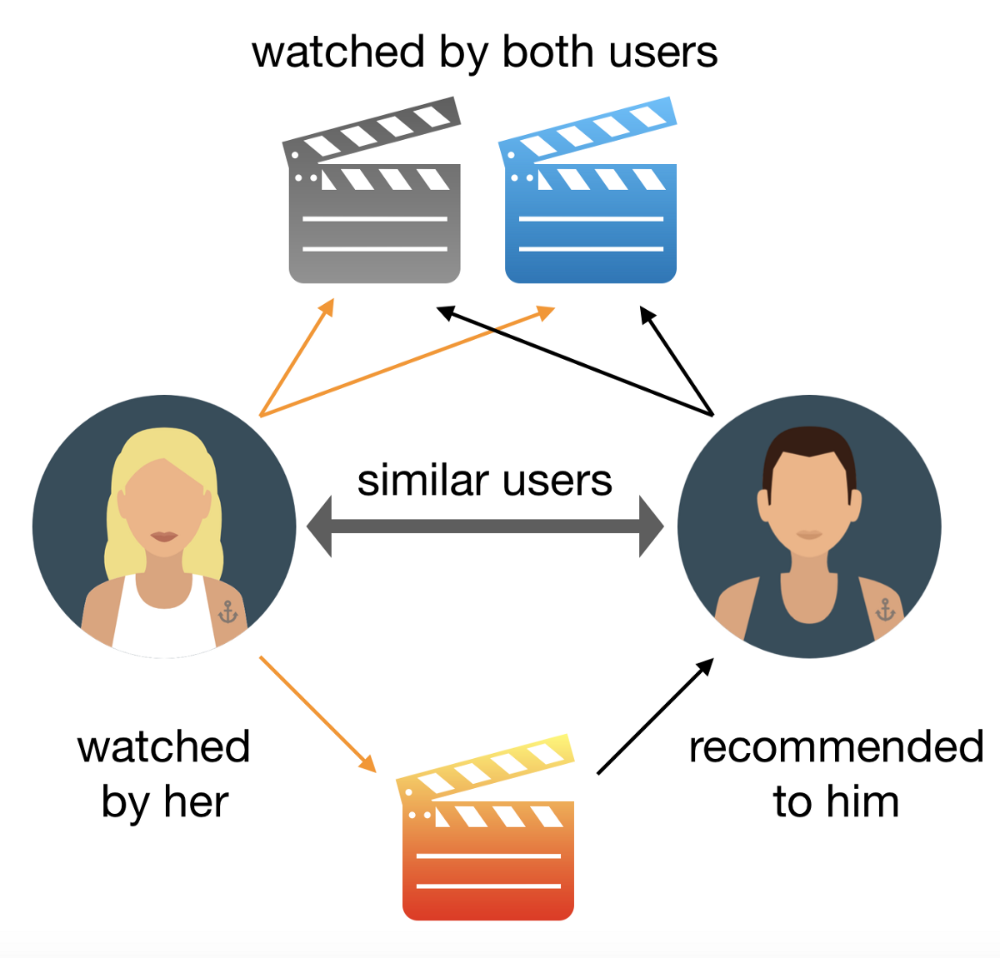

# Movie Recommendation System

The aim of this project is to build a movie recommendation system based on collaborative filtering. User-User Based Collaborative filtering is used to make recommendations to any user by finding similar users. The flow of the project is such that the system will input a user and the trained model will recommend a list of movies. The collaborative filtering used in the project is built by identifying similar users of the input user and then try to predict the rating of the movies not watched by the input user and then recommend the predicted highest rated movies to that user.

## Data Source and Merging Data
The data used is this project is the MovieLens-100k data. The two files from this folder is used: user and movie data. The user data contains user’s rating of different movie. Most of the data is empty as every user has not watched every movie. Next is the movie data where we have movie titles and its genres attributes. Finally, both files are combined and used as a single dataframe to build this recommendation system.

## Technical Approach
The item-item based collaborative filtering is implemented using KNN technique using cosine similarity as the metric. The dataframe is pivoted to be suitable to fit the knn method. The similar users are found and then the ratings are predicted for unwatched movies for the input user. Finally, the highest predicted rated movies are recommended to watch. <b>Here the coldstart problem is solved by recommending the most watched and most highly rated movies to the new user.</b>

## Results
The model takes in an input user id and five recommended movies are displayed. The model is able to find five similar users with the help of KNN model built. This type of recommendation is very useful as the user is not restricted to a particular genre or a characteristic of a movie. The new user is recommended the movies which are watched by at least 200 people and having rating more than 4.

